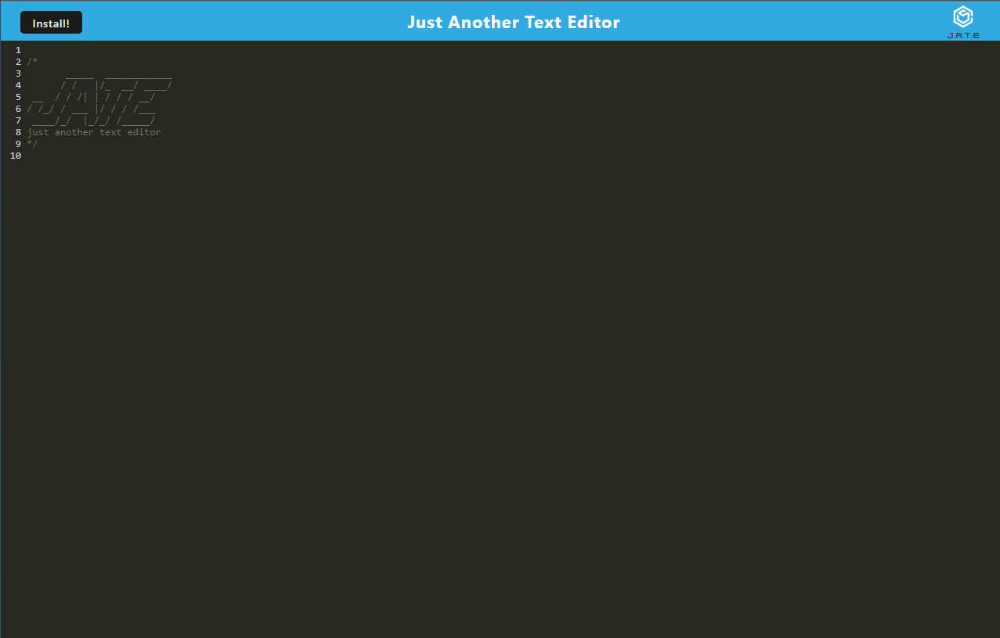

# Just Another Text Editor (JATE)

[](https://opensource.org/licenses/MIT)

JATE, short for "Just Another Text Editor," is a simple and lightweight text editor built using Webpack, Node.js, and Express. It provides a user-friendly interface for creating, editing, and saving text documents online. JATE is deployed on Heroku for easy access and use.

## Features

- Single Document editor.
- Persistant save feature so you can exit and re-enter the page and your notes will still be there.
- User-friendly and responsive interface.
- Hosted on Heroku for convenient access from anywhere.

## Demo

You can access a live demo of JATE [Here](https://brendan-aper-nate-6c94bcacf63b.herokuapp.com/)
You can also view the Github Repository [Here](https://github.com/brendan-aper/PWA-Text-Editor)



## Installation

Clone the repository to your local machine:

```bash
git clone https://github.com/brendan-aper/PWA-Text-Editor.git
```

Navigate to the project directory:

```bash
cd jate
```

Install the project dependencies:

```bash
npm install
```

## Running Locally

Start the development server:

```bash
npm start
```

Open your web browser and visit

```
http://localhost:3000
```

## Contributing

No contributions are being taken at this time

## Credits

The source code for much of this project was provided by [EDX Coding Bootcamp](https://github.com/coding-boot-camp/)

## Questions

Feel free to follow me on [Github](https://github.com/brendan-aper)
`OR`
[Email](mailto:brendanaper@gmail.com) me if you have any questions.

## License

MIT License

Copyright (c) 2023 brendan-aper

Permission is hereby granted, free of charge, to any person obtaining a copy
of this software and associated documentation files (the "Software"), to deal
in the Software without restriction, including without limitation the rights
to use, copy, modify, merge, publish, distribute, sublicense, and/or sell
copies of the Software, and to permit persons to whom the Software is
furnished to do so, subject to the following conditions:

The above copyright notice and this permission notice shall be included in all
copies or substantial portions of the Software.

THE SOFTWARE IS PROVIDED "AS IS", WITHOUT WARRANTY OF ANY KIND, EXPRESS OR
IMPLIED, INCLUDING BUT NOT LIMITED TO THE WARRANTIES OF MERCHANTABILITY,
FITNESS FOR A PARTICULAR PURPOSE AND NONINFRINGEMENT. IN NO EVENT SHALL THE
AUTHORS OR COPYRIGHT HOLDERS BE LIABLE FOR ANY CLAIM, DAMAGES OR OTHER
LIABILITY, WHETHER IN AN ACTION OF CONTRACT, TORT OR OTHERWISE, ARISING FROM,
OUT OF OR IN CONNECTION WITH THE SOFTWARE OR THE USE OR OTHER DEALINGS IN THE
SOFTWARE.
